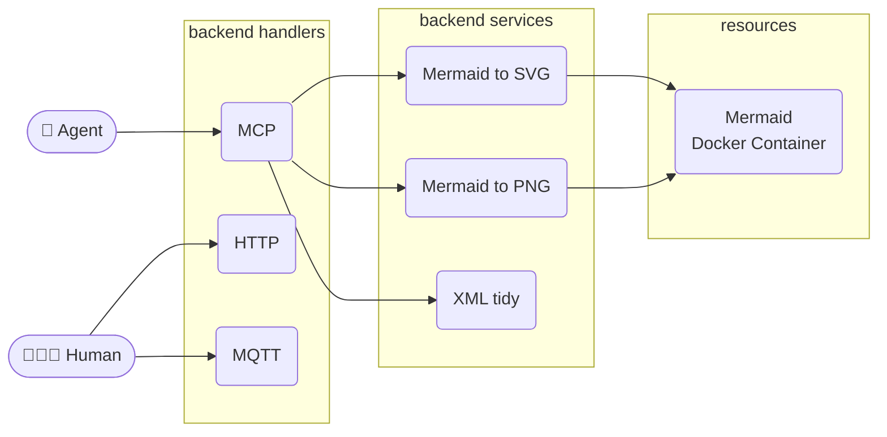

```mermaid
flowchart LR
  A1([🤖 Agent])
  A2([👩🏻‍💻 Human])

  subgraph backend handlers
    B1(MCP)
    B2(HTTP)
    B3(MQTT)
  end

  subgraph backend services
    C1(Mermaid to SVG)
    C2(Mermaid to PNG)
    C3(XML tidy)
  end

  subgraph resources
    D1(Mermaid<br>Docker Container)
  end

  A1 --> B1
  A2 --> B2 & B3
  B1 --> C1 & C2 & C3
  C1 & C2 --> D1
```
