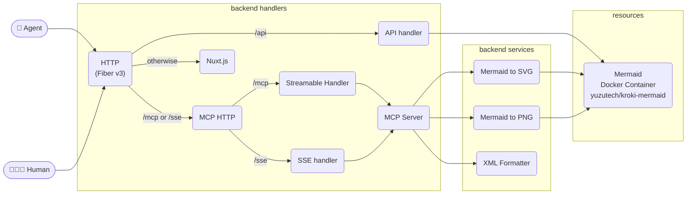

```mermaid
flowchart LR
  A1([🤖 Agent])
  A2([👩🏻‍💻 Human])

  subgraph backend handlers
    B1("HTTP<br>(Fiber v3)")
    B2("API handler")
    B3("MCP HTTP")
    B4("Streamable Handler")
    B5("SSE handler")
    B6("MCP Server")
    B7("Nuxt.js")
  end

  subgraph backend services
    C1(Mermaid to SVG)
    C2(Mermaid to PNG)
    C3(XML Formatter)
  end

  subgraph resources
    D1(Mermaid<br>Docker Container<br>yuzutech/kroki-mermaid)
  end

  A1 --> B1
  A2 --> B1
  B1 --> |/api| B2
  B1 --> |/mcp or /sse| B3
  B1 --> |otherwise| B7
  B3 --> |/mcp| B4
  B3 --> |/sse| B5
  B4 & B5 --> B6
  B6 --> C1 & C2 & C3
  B2 --> D1
  C1 & C2 --> D1
```
