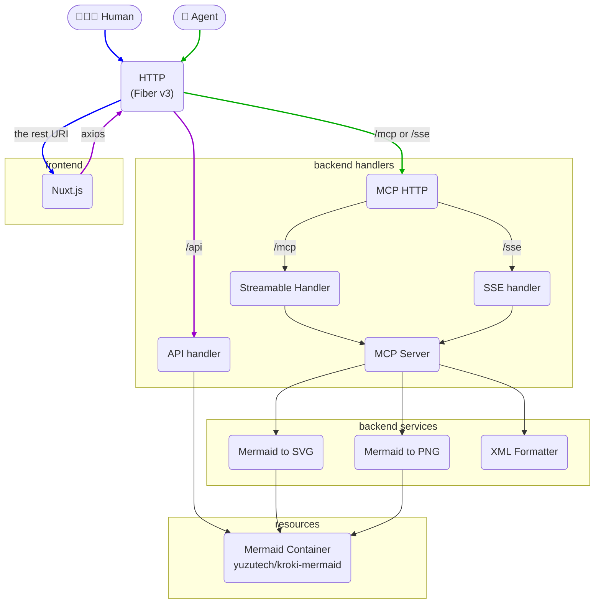

```mermaid
flowchart TD
  A1(["👩🏻‍💻 Human"])
  A2(["🤖 Agent"])

  B1("HTTP<br>(Fiber v3)")

  subgraph backend handlers  
    B2("API handler")
    B3("MCP HTTP")
    B4("Streamable Handler")
    B5("SSE handler")
    B6("MCP Server")
  end

  subgraph backend services
    C1(Mermaid to SVG)
    C2(Mermaid to PNG)
    C3(XML Formatter)
  end

  subgraph frontend
    B7("Nuxt.js")
  end

  subgraph resources
    D1(Mermaid Container<br>yuzutech/kroki-mermaid)
  end

  %% human path
  A1 --> B1
  B1 --> |the rest URI| B7
  linkStyle 0,1 stroke:#0000ff,stroke-width:2px

  %% agent path
  A2 --> B1
  B1 --> |/mcp or /sse| B3
  linkStyle 2,3 stroke:#00aa00,stroke-width:2px

  %% api path
  B7 --> |axios| B1
  B1 --> |/api| B2
  linkStyle 4,5 stroke:#9900cc,stroke-width:2px

  B3 --> |/mcp| B4
  B3 --> |/sse| B5
  B4 & B5 --> B6
  B6 --> C1 & C2 & C3
  B2 --> D1
  C1 & C2 --> D1
```
